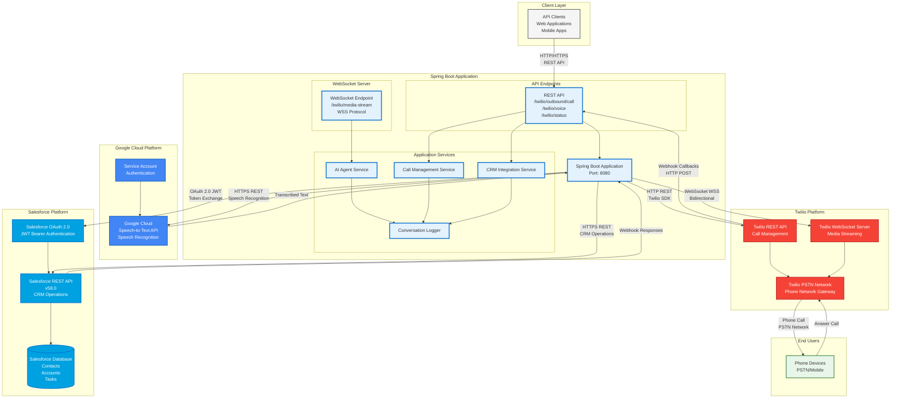
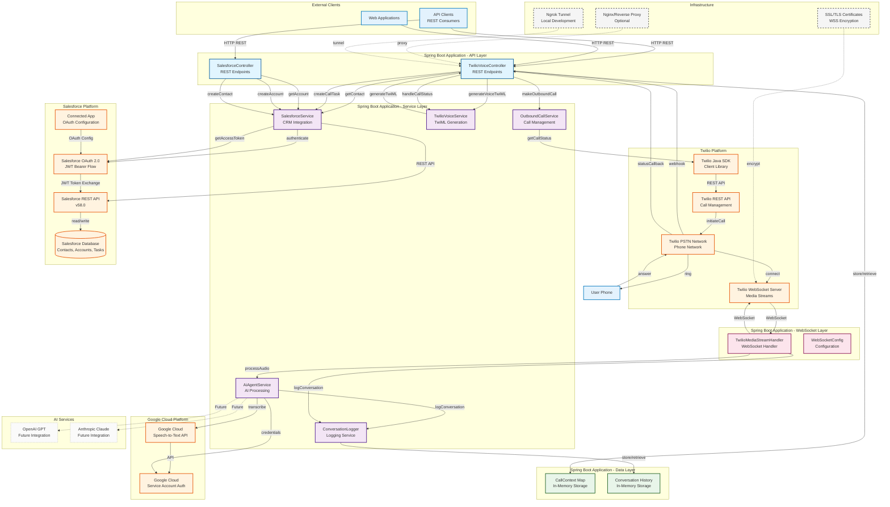

# Twilio Outbound Call & Status API - Architecture Diagram

## System Architecture Overview

This document provides a comprehensive architecture diagram and flow description for the Twilio outbound call and status API system.

## High-Level System Architecture



## System Integration Overview

### 1. Twilio Platform Integration

**Purpose**: Voice call management and real-time audio streaming

**Components**:
- **Twilio REST API**: Manages call lifecycle (initiate, status, terminate)
- **Twilio WebSocket Server**: Handles bidirectional audio streaming
- **Twilio PSTN Network**: Connects to public telephone network

**Integration Points**:
- **REST API**: `POST /twilio/outbound/call` → Creates call via Twilio SDK
- **Webhooks**: Twilio → `POST /twilio/voice` (TwiML generation)
- **Webhooks**: Twilio → `POST /twilio/status` (call status updates)
- **WebSocket**: Twilio ↔ Application (`wss://.../twilio/media-stream`)

**Data Flow**:
1. Application initiates call via Twilio REST API
2. Twilio calls user's phone via PSTN
3. When answered, Twilio requests TwiML from application
4. Twilio establishes WebSocket connection for audio streaming
5. Real-time audio flows bidirectionally via WebSocket
6. Twilio sends status callbacks on call events

**Protocols**: HTTP REST, WebSocket (WSS), TwiML XML

---

### 2. Google Cloud Speech-to-Text Integration

**Purpose**: Convert spoken audio to text

**Components**:
- **Google Cloud Speech-to-Text API**: Cloud-based speech recognition service
- **Service Account Authentication**: Secure API access

**Integration Points**:
- **REST API**: Application → Google Cloud Speech-to-Text API
- **Authentication**: Service Account JSON credentials

**Data Flow**:
1. Application receives audio chunks via WebSocket (μ-law format)
2. Converts μ-law → PCM (16-bit linear audio)
3. Sends PCM audio to Google Cloud Speech-to-Text API
4. Receives transcribed text response
5. Uses transcription for AI processing and logging

**Protocols**: HTTPS REST, gRPC (optional)

**Audio Format**: 
- Input: PCM 16-bit, 8000 Hz (from Twilio)
- Output: Text transcription with confidence scores

---

### 3. Salesforce Platform Integration

**Purpose**: CRM integration for contact management and task creation

**Components**:
- **Salesforce OAuth 2.0**: JWT Bearer Flow authentication
- **Salesforce REST API**: CRM operations (v58.0)
- **Salesforce Database**: Cloud database for Contacts, Accounts, Tasks

**Integration Points**:
- **Authentication**: Application → Salesforce OAuth 2.0 (JWT Bearer Flow)
- **REST API**: Application → Salesforce REST API
  - `GET /services/data/v58.0/sobjects/Contact/{id}` - Retrieve contact
  - `POST /services/data/v58.0/sobjects/Task/` - Create task
  - `GET /services/data/v58.0/query` - SOQL queries

**Data Flow**:
1. Application authenticates using JWT Bearer Flow
2. Retrieves Contact details before making call
3. Uses Contact's phone number and description for call
4. After call completion, creates Salesforce Task
5. Links Task to Contact (WhoId) and Account (WhatId)
6. Stores conversation log in Task Description

**Protocols**: HTTPS REST, OAuth 2.0 JWT Bearer Flow

**Authentication Flow**:
1. Application creates signed JWT with Connected App credentials
2. Exchanges JWT for access token via `/services/oauth2/token`
3. Uses access token for all subsequent API calls
4. Token cached and refreshed as needed

---

### 4. WebSocket Integration

**Purpose**: Real-time bidirectional audio streaming

**Components**:
- **Application WebSocket Server**: Spring WebSocket endpoint
- **Twilio WebSocket Client**: Connects from Twilio platform

**Integration Points**:
- **Endpoint**: `wss://{domain}/twilio/media-stream`
- **Protocol**: WebSocket Secure (WSS)
- **Handler**: `TwilioMediaStreamHandler`

**Data Flow**:
1. Twilio establishes WebSocket connection when call answered
2. Twilio sends audio chunks as JSON messages with base64-encoded μ-law audio
3. Application buffers audio chunks, detects silence
4. Application processes buffered audio (transcription, AI response)
5. Application sends audio responses back via WebSocket
6. Twilio plays audio responses to user's phone

**Message Format**:
```json
{
  "event": "media",
  "media": {
    "payload": "base64-encoded-audio-data"
  }
}
```

**Events**: `connected`, `start`, `media`, `stop`

**Protocols**: WebSocket Secure (WSS), JSON messages

---

## System Communication Matrix

| From System | To System | Protocol | Purpose | Frequency |
|------------|-----------|----------|---------|-----------|
| Client | Spring Boot App | HTTP REST | Initiate calls, query status | On-demand |
| Spring Boot App | Twilio REST API | HTTP REST | Create calls, get status | Per call |
| Twilio | Spring Boot App | HTTP REST | Webhooks (TwiML, status) | Per call event |
| Twilio | Spring Boot App | WebSocket WSS | Audio streaming | Real-time (continuous) |
| Spring Boot App | Google Cloud STT | HTTPS REST | Speech transcription | Per speech segment |
| Spring Boot App | Salesforce OAuth | HTTPS REST | Token exchange | On token expiry |
| Spring Boot App | Salesforce API | HTTPS REST | CRM operations | Per call |
| Twilio PSTN | Phone | PSTN | Voice calls | Per call |

---

## Architecture Diagram

```mermaid
graph TB
    subgraph "Client Application"
        Client[Client/API Consumer]
    end

    subgraph "Spring Boot Application"
        subgraph "REST Controllers"
            TVC[TwilioVoiceController]
        end
        
        subgraph "Services Layer"
            OCS[OutboundCallService]
            TVS[TwilioVoiceService]
            SS[SalesforceService]
            AAS[AiAgentService]
            CL[ConversationLogger]
        end
        
        subgraph "WebSocket Handler"
            TMSH[TwilioMediaStreamHandler]
        end
        
        subgraph "Data Storage"
            CC[CallContext Map<br/>contactId, accountId, phone]
            CH[Conversation History<br/>sessionId → entries]
        end
    end

    subgraph "External Services"
        subgraph "Twilio Platform"
            TAPI[Twilio REST API]
            TWS[Twilio WebSocket Server]
            TPSTN[Twilio PSTN Network]
        end
        
        subgraph "Salesforce"
            SAPI[Salesforce REST API<br/>OAuth 2.0 JWT Bearer]
            SDB[(Salesforce Database<br/>Contacts, Accounts, Tasks)]
        end
        
        subgraph "AI Services"
            GCSTT[Google Cloud<br/>Speech-to-Text]
            AI[AI Response Generator<br/>OpenAI/Claude/etc]
        end
    end

    subgraph "End User"
        Phone[Phone Device]
    end

    %% Outbound Call Initiation Flow
    Client -->|1. POST /twilio/outbound/call| TVC
    TVC -->|2. If contactId provided| SS
    SS -->|3. GET Contact by ID| SAPI
    SAPI -->|4. Contact Details| SS
    SS -->|5. Contact Record| TVC
    TVC -->|6. makeOutboundCall| OCS
    OCS -->|7. Call.creator| TAPI
    TAPI -->|8. Initiate Call| TPSTN
    TPSTN -->|9. Ring Phone| Phone
    Phone -->|10. Answer Call| TPSTN
    
    %% TwiML Generation Flow
    TPSTN -->|11. POST /twilio/voice| TVC
    TVC -->|12. generateVoiceTwiML| TVS
    TVS -->|13. TwiML Response| TPSTN
    
    %% WebSocket Connection Flow
    TPSTN -->|14. Connect WebSocket| TWS
    TWS -->|15. WebSocket Messages| TMSH
    
    %% Real-time Audio Processing Flow
    TMSH -->|16. Buffer Audio Chunks| TMSH
    TMSH -->|17. Silence Detected| AAS
    AAS -->|18. Convert μ-law to PCM| AAS
    AAS -->|19. Transcribe Audio| GCSTT
    GCSTT -->|20. Transcribed Text| AAS
    AAS -->|21. Log User Speech| CL
    CL -->|22. Store Entry| CH
    AAS -->|23. Generate AI Response| AI
    AI -->|24. AI Response Text| AAS
    AAS -->|25. Log AI Response| CL
    CL -->|26. Store Entry| CH
    AAS -->|27. Convert Text to Speech| TMSH
    TMSH -->|28. Send Audio Stream| TWS
    TWS -->|29. Play Audio| Phone
    
    %% Call Status Update Flow
    TPSTN -->|30. POST /twilio/status| TVC
    TVC -->|31. Check Terminal Status| TVC
    TVC -->|32. Retrieve Call Context| CC
    CC -->|33. Call Context Data| TVC
    TVC -->|34. Get Conversation Log| CL
    CL -->|35. Format Log by CallSid| CH
    CH -->|36. Formatted Log| CL
    CL -->|37. Conversation Log| TVC
    TVC -->|38. createCallTaskForContactAndAccount| SS
    SS -->|39. Authenticate JWT Bearer| SAPI
    SAPI -->|40. Access Token| SS
    SS -->|41. POST /sobjects/Task| SAPI
    SAPI -->|42. Task Created| SDB
    SDB -->|43. Task Record| SAPI
    SAPI -->|44. Success Response| SS
    SS -->|45. Task Created| TVC

    %% Styling
    classDef controller fill:#e1f5ff,stroke:#01579b,stroke-width:2px
    classDef service fill:#f3e5f5,stroke:#4a148c,stroke-width:2px
    classDef external fill:#fff3e0,stroke:#e65100,stroke-width:2px
    classDef storage fill:#e8f5e9,stroke:#1b5e20,stroke-width:2px
    classDef websocket fill:#fce4ec,stroke:#880e4f,stroke-width:2px
    
    class TVC controller
    class OCS,TVS,SS,AAS,CL service
    class TAPI,TWS,TPSTN,SAPI,SDB,GCSTT,AI external
    class CC,CH storage
    class TMSH websocket
```



## Detailed Flow Descriptions

### 1. Outbound Call Initiation Flow

**Step-by-Step Process:**

1. **Client Request**: Client sends `POST /twilio/outbound/call` with:
   ```json
   {
     "contactId": "003...",
     "toNumber": "+1234567890",
     "fromNumber": "+18026590229",
     "customMessage": "Hello..."
   }
   ```

2. **Salesforce Contact Retrieval** (if `contactId` provided):
   - `TwilioVoiceController` calls `SalesforceService.getContact(contactId)`
   - Salesforce authenticates using JWT Bearer Flow
   - Retrieves Contact details: `MobilePhone`, `Phone`, `Description`, `FirstName`, `LastName`
   - Populates `toNumber` from Contact's `MobilePhone` or `Phone`
   - Populates `customMessage` from Contact's `Description` or generates default

3. **Call Context Storage**:
   - Stores `{contactId, accountId, phone}` in `callContextBySid` map
   - Maps `CallSid` → `CallTaskContext` for later Task creation

4. **Twilio Call Creation**:
   - `OutboundCallService.makeOutboundCall()` creates call via Twilio SDK
   - Sets `TwiML URL`: `{callbackBaseUrl}/twilio/voice?message={customMessage}`
   - Sets `Status Callback URL`: `{callbackBaseUrl}/twilio/status`
   - Returns `CallSid` and initial status

5. **Twilio Initiates Call**:
   - Twilio calls destination phone number
   - User answers the call

### 2. TwiML Generation & WebSocket Setup Flow

**Step-by-Step Process:**

1. **TwiML Request**: When call is answered, Twilio calls `POST /twilio/voice`

2. **TwiML Generation**:
   - `TwilioVoiceService.generateVoiceTwiML()` generates TwiML:
     ```xml
     <Response>
         <Start>
             <Stream url="wss://.../twilio/media-stream" />
         </Start>
         <Say voice="alice">{customMessage}</Say>
         <Pause length="60" />
     </Response>
     ```

3. **WebSocket Connection**:
   - Twilio establishes WebSocket connection to `wss://.../twilio/media-stream`
   - `TwilioMediaStreamHandler` receives `connected` event
   - Session mapping: `sessionId` → `CallSid`

### 3. Real-time Audio Processing Flow

**Step-by-Step Process:**

1. **Audio Streaming**:
   - Twilio sends audio chunks via WebSocket (`media` events)
   - Each chunk contains base64-encoded μ-law audio (8-bit, 8000 Hz)

2. **Audio Buffering & Energy Detection**:
   - `TwilioMediaStreamHandler` buffers audio chunks
   - Detects audio energy to filter silence/noise
   - Tracks silence timeout (default: 1500ms)

3. **Speech Processing** (when silence detected):
   - `processBufferedAudio()` called with accumulated audio
   - `AiAgentService.processAudio()`:
     - Converts μ-law → PCM (16-bit linear)
     - Sends to Google Cloud Speech-to-Text
     - Receives transcribed text

4. **Conversation Logging**:
   - `ConversationLogger.logConversation()` stores:
     - `sessionId`, `callSid`, `type` ("USER" or "AI"), `text`, `timestamp`

5. **AI Response Generation**:
   - `AiAgentService.generateAiResponse()` processes transcribed text
   - Generates response (currently placeholder, ready for OpenAI/Claude integration)

6. **Text-to-Speech & Playback**:
   - AI response sent back via WebSocket as audio stream
   - Twilio plays audio to user's phone

### 4. Call Status Update & Task Creation Flow

**Step-by-Step Process:**

1. **Status Callback**: Twilio sends `POST /twilio/status` when call status changes:
   ```
   CallSid=CA...
   CallStatus=completed|no-answer|busy|failed|canceled|completed-remote
   ```

2. **Terminal Status Detection**:
   - `TwilioVoiceController.handleCallStatus()` checks if status is terminal
   - Terminal statuses trigger Task creation

3. **Call Context Retrieval**:
   - Retrieves `CallTaskContext` from `callContextBySid` using `CallSid`
   - Contains: `contactId`, `accountId`, `phone`

4. **Conversation Log Retrieval**:
   - `ConversationLogger.getFormattedConversationLogByCallSid(callSid)`
   - Scans all sessions to find entries matching `callSid`
   - Formats as:
     ```
     ================================================================================
     CONVERSATION LOG - CallSid: CA...
     ================================================================================
     [HH:mm:ss] USER: ...
     [HH:mm:ss] AI: ...
     ================================================================================
     ```

5. **Salesforce Task Creation**:
   - `SalesforceService.createCallTaskForContactAndAccount()`:
     - Authenticates with Salesforce (JWT Bearer Flow)
     - Maps Twilio `CallStatus` → Salesforce Task `Status`:
       - `completed` → `Completed`
       - `no-answer`, `busy`, `failed`, `canceled` → `Not Answered`
     - Creates Task payload:
       ```json
       {
         "WhoId": "{contactId}",
         "WhatId": "{accountId}",
         "Subject": "AI Voice Call - {callStatus}",
         "Status": "{mappedStatus}",
         "TaskSubtype": "Call",
         "CallType": "Outbound",
         "CallDisposition": "{callStatus}",
         "CallObject": "{callSid}",
         "Phone": "{phone}",
         "Description": "{conversationLog}",
         "ActivityDate": "{today}"
       }
       ```
     - POSTs to `/services/data/v58.0/sobjects/Task/`

6. **Task Created**: Salesforce returns Task ID, stored in Salesforce database

## High-Level System Components Architecture



## Component Descriptions

### API Layer Components

#### TwilioVoiceController
- **Purpose**: REST API endpoints for Twilio voice operations
- **Endpoints**:
  - `POST /twilio/outbound/call` - Initiate outbound calls
  - `POST /twilio/voice` - Generate TwiML for calls
  - `POST /twilio/status` - Handle call status callbacks
  - `GET /twilio/call/{callSid}/status` - Get call status
- **Dependencies**: OutboundCallService, TwilioVoiceService, SalesforceService, ConversationLogger

#### SalesforceController
- **Purpose**: REST API endpoints for Salesforce operations
- **Endpoints**:
  - `GET /api/salesforce/account/{accountId}` - Get account with contacts
  - `POST /api/salesforce/account` - Create account
  - `POST /api/salesforce/contact` - Create contact
- **Dependencies**: SalesforceService

### Service Layer Components

#### OutboundCallService
- **Purpose**: Manages outbound call creation and status tracking
- **Responsibilities**:
  - Create Twilio calls via SDK
  - Build TwiML and callback URLs
  - Retrieve call status from Twilio
- **Dependencies**: Twilio Java SDK

#### TwilioVoiceService
- **Purpose**: Generates TwiML XML for voice calls
- **Responsibilities**:
  - Create TwiML with WebSocket stream configuration
  - Set greeting messages and pause durations
  - Handle call status updates
- **Dependencies**: None (pure service)

#### SalesforceService
- **Purpose**: Integrates with Salesforce CRM
- **Responsibilities**:
  - Authenticate using JWT Bearer Flow
  - Retrieve Contact and Account details
  - Create Salesforce Tasks
  - Map Twilio call statuses to Salesforce Task statuses
- **Dependencies**: Spring WebFlux WebClient, Salesforce REST API

#### AiAgentService
- **Purpose**: Processes audio and generates AI responses
- **Responsibilities**:
  - Convert μ-law audio to PCM format
  - Transcribe audio using Google Cloud Speech-to-Text
  - Generate AI responses (placeholder, ready for OpenAI/Claude)
  - Handle end-of-call detection
- **Dependencies**: Google Cloud Speech-to-Text API, ConversationLogger

#### ConversationLogger
- **Purpose**: Logs and stores conversation history
- **Responsibilities**:
  - Store user speech and AI responses
  - Format conversation logs for Salesforce Tasks
  - Retrieve logs by sessionId or callSid
- **Dependencies**: None (in-memory storage)

### WebSocket Layer Components

#### TwilioMediaStreamHandler
- **Purpose**: Handles real-time bidirectional audio streaming
- **Responsibilities**:
  - Process WebSocket connections from Twilio
  - Handle `connected`, `start`, `media`, `stop` events
  - Buffer audio chunks with energy detection
  - Detect silence and trigger audio processing
  - Send audio responses back to Twilio
- **Dependencies**: AiAgentService, ConversationLogger

#### WebSocketConfig
- **Purpose**: Configures WebSocket endpoints
- **Responsibilities**:
  - Register WebSocket handlers
  - Configure allowed origins
  - Set up WebSocket path mappings
- **Dependencies**: Spring WebSocket framework

### Data Layer Components

#### CallContext Map
- **Purpose**: In-memory storage for call context
- **Data Structure**: `ConcurrentMap<String, CallTaskContext>`
- **Stores**: `{contactId, accountId, phone}` mapped by `CallSid`
- **Lifecycle**: Created on call initiation, removed on call completion

#### Conversation History
- **Purpose**: In-memory storage for conversation logs
- **Data Structure**: `ConcurrentMap<String, List<ConversationEntry>>`
- **Stores**: User speech and AI responses by sessionId/callSid
- **Lifecycle**: Created during conversation, persists until application restart

### External Platform Components

#### Twilio Platform
- **Twilio REST API**: RESTful API for call management
- **Twilio WebSocket Server**: Real-time media streaming server
- **Twilio PSTN Network**: Public Switched Telephone Network integration
- **Twilio Java SDK**: Client library for Twilio services

#### Salesforce Platform
- **Salesforce REST API**: RESTful API for CRM operations (v58.0)
- **Salesforce OAuth 2.0**: JWT Bearer Flow authentication
- **Salesforce Database**: Cloud database for Contacts, Accounts, Tasks
- **Connected App**: OAuth application configuration

#### Google Cloud Platform
- **Google Cloud Speech-to-Text API**: Speech recognition service
- **Google Cloud Service Account Auth**: Service account authentication

### Infrastructure Components

#### Nginx/Reverse Proxy (Optional)
- **Purpose**: Load balancing and SSL termination
- **Usage**: Production deployments

#### Ngrok Tunnel (Development)
- **Purpose**: Expose local server to internet for webhook testing
- **Usage**: Local development only

#### SSL/TLS Certificates
- **Purpose**: Encrypt WebSocket connections (WSS)
- **Usage**: Required for production WebSocket connections

## Communication Protocols

### HTTP/REST
- **Used By**: API Clients → Controllers, Controllers → Services, Services → External APIs
- **Protocol**: HTTP/1.1, HTTPS
- **Content Types**: `application/json`, `application/xml` (TwiML)

### WebSocket (WSS)
- **Used By**: Twilio ↔ TwilioMediaStreamHandler
- **Protocol**: WebSocket Secure (WSS)
- **Message Format**: JSON with base64-encoded audio payloads
- **Events**: `connected`, `start`, `media`, `stop`

### OAuth 2.0 JWT Bearer Flow
- **Used By**: SalesforceService → Salesforce
- **Protocol**: OAuth 2.0 with JWT assertion
- **Grant Type**: `urn:ietf:params:oauth:grant-type:jwt-bearer`

## Data Flow Patterns

### Synchronous Request-Response
- API Clients → Controllers → Services → External APIs
- Used for: Call initiation, Salesforce queries, status checks

### Asynchronous Webhooks
- Twilio → Controllers (callbacks)
- Used for: Call status updates, TwiML requests

### Real-time Bidirectional Streaming
- Twilio ↔ WebSocket Handler
- Used for: Audio streaming, real-time conversation

### Reactive Programming
- SalesforceService uses Spring WebFlux
- Non-blocking I/O for Salesforce API calls

## Component Responsibilities

### TwilioVoiceController
- **REST Endpoints**:
  - `POST /twilio/outbound/call` - Initiate outbound call
  - `POST /twilio/voice` - Generate TwiML for call
  - `POST /twilio/status` - Handle call status updates
  - `GET /twilio/call/{callSid}/status` - Get call status
- **Responsibilities**:
  - Orchestrates outbound call flow
  - Integrates Salesforce Contact retrieval
  - Manages call context (`callContextBySid`)
  - Triggers Salesforce Task creation on call completion

### OutboundCallService
- **Responsibilities**:
  - Creates Twilio calls via SDK
  - Builds TwiML and status callback URLs
  - Retrieves call status from Twilio

### TwilioVoiceService
- **Responsibilities**:
  - Generates TwiML XML for voice calls
  - Configures WebSocket stream URL
  - Sets greeting message and pause duration

### TwilioMediaStreamHandler
- **Responsibilities**:
  - Handles WebSocket connections from Twilio
  - Processes `connected`, `start`, `media`, `stop` events
  - Buffers audio chunks with energy detection
  - Detects silence and triggers audio processing
  - Sends audio responses back to Twilio

### AiAgentService
- **Responsibilities**:
  - Converts μ-law audio → PCM
  - Transcribes audio using Google Cloud Speech-to-Text
  - Generates AI responses (placeholder, ready for integration)
  - Converts text → speech (via Twilio)

### ConversationLogger
- **Responsibilities**:
  - Logs user speech and AI responses
  - Stores conversation history by `sessionId` and `callSid`
  - Formats conversation logs for Salesforce Task descriptions

### SalesforceService
- **Responsibilities**:
  - Authenticates with Salesforce using JWT Bearer Flow
  - Retrieves Contact details
  - Creates Salesforce Tasks linked to Contacts and Accounts
  - Maps Twilio call statuses to Salesforce Task statuses

## Data Flow Summary

```
┌─────────┐
│ Client  │
└────┬────┘
     │ POST /twilio/outbound/call {contactId}
     ▼
┌─────────────────────┐
│ TwilioVoiceController│
└────┬────────────────┘
     │ getContact(contactId)
     ▼
┌─────────────────────┐      ┌──────────────┐
│ SalesforceService   │─────▶│ Salesforce   │
└────┬────────────────┘      └──────────────┘
     │ Contact {mobilePhone, description}
     ▼
┌─────────────────────┐
│ OutboundCallService │
└────┬────────────────┘
     │ Call.creator()
     ▼
┌─────────────────────┐      ┌──────────────┐
│ Twilio REST API     │─────▶│ Twilio PSTN  │
└─────────────────────┘      └──────┬───────┘
                                    │ Ring
                                    ▼
                              ┌──────────────┐
                              │ User Phone    │
                              └──────┬───────┘
                                     │ Answer
                                     ▼
┌─────────────────────┐      ┌──────────────┐
│ POST /twilio/voice  │◀─────│ Twilio        │
└────┬────────────────┘      └──────────────┘
     │ Generate TwiML
     ▼
┌─────────────────────┐
│ TwilioVoiceService  │
└────┬────────────────┘
     │ TwiML {Start Stream, Say, Pause}
     ▼
┌─────────────────────┐      ┌──────────────┐
│ WebSocket Connect   │◀─────│ Twilio        │
│ /twilio/media-stream│      └──────────────┘
└────┬────────────────┘
     │ Audio chunks (μ-law)
     ▼
┌──────────────────────────┐
│ TwilioMediaStreamHandler │
└────┬─────────────────────┘
     │ Buffer + Energy Detection
     │ Silence detected → Process
     ▼
┌─────────────────────┐
│ AiAgentService      │
└────┬────────────────┘
     │ Convert μ-law → PCM
     │ Transcribe
     ▼
┌─────────────────────┐      ┌──────────────┐
│ Google Cloud STT    │─────▶│ Transcription │
└────┬────────────────┘      └──────────────┘
     │ Text
     ▼
┌─────────────────────┐
│ ConversationLogger  │
└────┬────────────────┘
     │ Log USER speech
     ▼
┌─────────────────────┐
│ AI Response Gen     │
└────┬────────────────┘
     │ Response text
     ▼
┌─────────────────────┐
│ ConversationLogger  │
└────┬────────────────┘
     │ Log AI response
     ▼
┌──────────────────────────┐      ┌──────────────┐
│ TwilioMediaStreamHandler │─────▶│ Twilio       │
└──────────────────────────┘      └──────┬───────┘
                                          │ Play audio
                                          ▼
                                    ┌──────────────┐
                                    │ User Phone    │
                                    └──────────────┘

... (conversation continues) ...

┌─────────────────────┐      ┌──────────────┐
│ POST /twilio/status │◀─────│ Twilio       │
│ {CallSid, Status}   │      └──────────────┘
└────┬────────────────┘
     │ Terminal status?
     ▼
┌─────────────────────┐
│ Get Call Context    │
│ Get Conversation Log│
└────┬────────────────┘
     │ {contactId, accountId, log}
     ▼
┌─────────────────────┐      ┌──────────────┐
│ SalesforceService   │─────▶│ Salesforce   │
│ createCallTask()    │      │ POST /Task   │
└─────────────────────┘      └──────────────┘
```

## Key Technologies

- **Spring Boot**: REST API framework
- **Spring WebFlux**: Reactive HTTP client for Salesforce
- **Twilio SDK**: Voice API and Media Streams
- **WebSocket**: Real-time bidirectional audio streaming
- **Google Cloud Speech-to-Text**: Speech recognition
- **Salesforce REST API**: CRM integration
- **JWT Bearer Flow**: OAuth 2.0 authentication
- **Maven**: Dependency management

## Configuration Requirements

### Twilio
- `twilio.account.sid`
- `twilio.auth.token`
- `twilio.phone.number`
- `twilio.callback.base.url` (public URL for webhooks)

### Salesforce
- `salesforce.client.id` (Connected App Consumer Key)
- `salesforce.jwt.subject` (Salesforce username)
- `salesforce.jwt.audience` (login.salesforce.com or test.salesforce.com)
- `salesforce.jwt.private-key-path` (RSA private key for JWT signing)

### Google Cloud
- `google.cloud.speech.enabled=true`
- `google.cloud.speech.credentials.path`
- `google.cloud.speech.language.code=en-US`

## Error Handling

- **Call Initiation Failures**: Returns error response with details
- **Salesforce Authentication Failures**: Retries with backoff for "unknown_error"
- **WebSocket Connection Failures**: Logged and handled gracefully
- **Audio Processing Failures**: Logged, conversation continues
- **Task Creation Failures**: Logged as warning, call completes successfully

## Scalability Considerations

- **Concurrent Calls**: Uses `ConcurrentHashMap` for thread-safe session management
- **Audio Buffering**: Per-session buffers prevent memory issues
- **Reactive Programming**: Spring WebFlux for non-blocking Salesforce API calls
- **WebSocket Sessions**: Each call has independent WebSocket session

## Security Considerations

- **JWT Authentication**: Secure Salesforce authentication without passwords
- **WebSocket Security**: WSS (WebSocket Secure) for encrypted connections
- **API Keys**: Stored in `application.properties` (use environment variables in production)
- **Input Validation**: `@Valid` annotations on request DTOs

