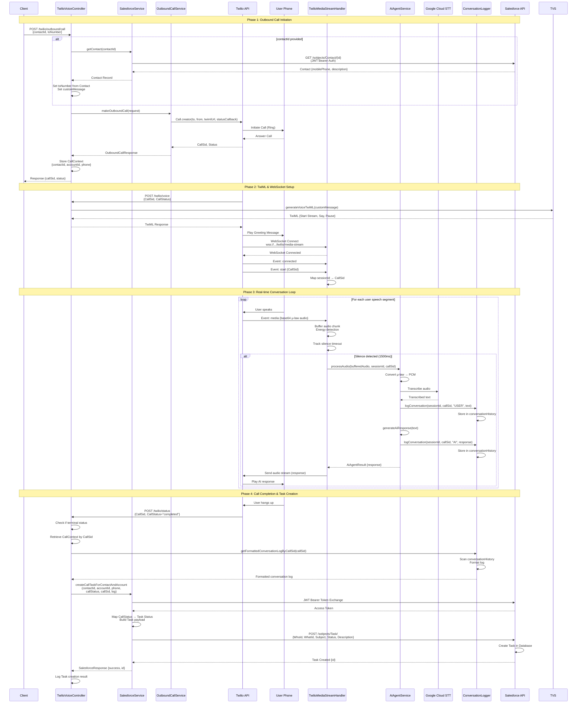

# Twilio Outbound Call & Status API - Architecture Diagram

## System Architecture Overview

This document provides a comprehensive architecture diagram and flow description for the Twilio outbound call and status API system.

## Architecture Diagram

```mermaid
graph TB
    subgraph "Client Application"
        Client[Client/API Consumer]
    end

    subgraph "Spring Boot Application"
        subgraph "REST Controllers"
            TVC[TwilioVoiceController]
        end
        
        subgraph "Services Layer"
            OCS[OutboundCallService]
            TVS[TwilioVoiceService]
            SS[SalesforceService]
            AAS[AiAgentService]
            CL[ConversationLogger]
        end
        
        subgraph "WebSocket Handler"
            TMSH[TwilioMediaStreamHandler]
        end
        
        subgraph "Data Storage"
            CC[CallContext Map<br/>contactId, accountId, phone]
            CH[Conversation History<br/>sessionId → entries]
        end
    end

    subgraph "External Services"
        subgraph "Twilio Platform"
            TAPI[Twilio REST API]
            TWS[Twilio WebSocket Server]
            TPSTN[Twilio PSTN Network]
        end
        
        subgraph "Salesforce"
            SAPI[Salesforce REST API<br/>OAuth 2.0 JWT Bearer]
            SDB[(Salesforce Database<br/>Contacts, Accounts, Tasks)]
        end
        
        subgraph "AI Services"
            GCSTT[Google Cloud<br/>Speech-to-Text]
            AI[AI Response Generator<br/>OpenAI/Claude/etc]
        end
    end

    subgraph "End User"
        Phone[Phone Device]
    end

    %% Outbound Call Initiation Flow
    Client -->|1. POST /twilio/outbound/call<br/>{contactId, toNumber}| TVC
    TVC -->|2. If contactId provided| SS
    SS -->|3. GET /services/data/v58.0/sobjects/Contact/{id}| SAPI
    SAPI -->|4. Contact Details<br/>{mobilePhone, description}| SS
    SS -->|5. Contact Record| TVC
    TVC -->|6. makeOutboundCall| OCS
    OCS -->|7. Call.creator<br/>{to, from, twimlUrl, statusCallback}| TAPI
    TAPI -->|8. Initiate Call| TPSTN
    TPSTN -->|9. Ring Phone| Phone
    Phone -->|10. Answer Call| TPSTN
    
    %% TwiML Generation Flow
    TPSTN -->|11. POST /twilio/voice<br/>{CallSid, CallStatus}| TVC
    TVC -->|12. generateVoiceTwiML| TVS
    TVS -->|13. TwiML Response<br/>{Start Stream, Say, Pause}| TPSTN
    
    %% WebSocket Connection Flow
    TPSTN -->|14. Connect WebSocket<br/>wss://.../twilio/media-stream| TWS
    TWS -->|15. WebSocket Messages<br/>{connected, start, media}| TMSH
    
    %% Real-time Audio Processing Flow
    TMSH -->|16. Buffer Audio Chunks<br/>with Energy Detection| TMSH
    TMSH -->|17. Silence Detected<br/>Process Buffered Audio| AAS
    AAS -->|18. Convert μ-law to PCM| AAS
    AAS -->|19. Transcribe Audio| GCSTT
    GCSTT -->|20. Transcribed Text| AAS
    AAS -->|21. Log User Speech| CL
    CL -->|22. Store Entry| CH
    AAS -->|23. Generate AI Response| AI
    AI -->|24. AI Response Text| AAS
    AAS -->|25. Log AI Response| CL
    CL -->|26. Store Entry| CH
    AAS -->|27. Convert Text to Speech<br/>via Twilio| TMSH
    TMSH -->|28. Send Audio Stream| TWS
    TWS -->|29. Play Audio| Phone
    
    %% Call Status Update Flow
    TPSTN -->|30. POST /twilio/status<br/>{CallSid, CallStatus}| TVC
    TVC -->|31. Check Terminal Status<br/>{completed, no-answer, busy, failed}| TVC
    TVC -->|32. Retrieve Call Context| CC
    CC -->|33. {contactId, accountId, phone}| TVC
    TVC -->|34. Get Conversation Log| CL
    CL -->|35. Format Log by CallSid| CH
    CH -->|36. Formatted Log| CL
    CL -->|37. Conversation Log| TVC
    TVC -->|38. createCallTaskForContactAndAccount| SS
    SS -->|39. Authenticate<br/>JWT Bearer Flow| SAPI
    SAPI -->|40. Access Token| SS
    SS -->|41. POST /services/data/v58.0/sobjects/Task/<br/>{WhoId, WhatId, Subject, Status, Description}| SAPI
    SAPI -->|42. Task Created| SDB
    SDB -->|43. Task Record| SAPI
    SAPI -->|44. Success Response| SS
    SS -->|45. Task Created| TVC

    %% Styling
    classDef controller fill:#e1f5ff,stroke:#01579b,stroke-width:2px
    classDef service fill:#f3e5f5,stroke:#4a148c,stroke-width:2px
    classDef external fill:#fff3e0,stroke:#e65100,stroke-width:2px
    classDef storage fill:#e8f5e9,stroke:#1b5e20,stroke-width:2px
    classDef websocket fill:#fce4ec,stroke:#880e4f,stroke-width:2px
    
    class TVC controller
    class OCS,TVS,SS,AAS,CL service
    class TAPI,TWS,TPSTN,SAPI,SDB,GCSTT,AI external
    class CC,CH storage
    class TMSH websocket
```

## Detailed Flow Descriptions

### 1. Outbound Call Initiation Flow

**Step-by-Step Process:**

1. **Client Request**: Client sends `POST /twilio/outbound/call` with:
   ```json
   {
     "contactId": "003...",
     "toNumber": "+1234567890",
     "fromNumber": "+18026590229",
     "customMessage": "Hello..."
   }
   ```

2. **Salesforce Contact Retrieval** (if `contactId` provided):
   - `TwilioVoiceController` calls `SalesforceService.getContact(contactId)`
   - Salesforce authenticates using JWT Bearer Flow
   - Retrieves Contact details: `MobilePhone`, `Phone`, `Description`, `FirstName`, `LastName`
   - Populates `toNumber` from Contact's `MobilePhone` or `Phone`
   - Populates `customMessage` from Contact's `Description` or generates default

3. **Call Context Storage**:
   - Stores `{contactId, accountId, phone}` in `callContextBySid` map
   - Maps `CallSid` → `CallTaskContext` for later Task creation

4. **Twilio Call Creation**:
   - `OutboundCallService.makeOutboundCall()` creates call via Twilio SDK
   - Sets `TwiML URL`: `{callbackBaseUrl}/twilio/voice?message={customMessage}`
   - Sets `Status Callback URL`: `{callbackBaseUrl}/twilio/status`
   - Returns `CallSid` and initial status

5. **Twilio Initiates Call**:
   - Twilio calls destination phone number
   - User answers the call

### 2. TwiML Generation & WebSocket Setup Flow

**Step-by-Step Process:**

1. **TwiML Request**: When call is answered, Twilio calls `POST /twilio/voice`

2. **TwiML Generation**:
   - `TwilioVoiceService.generateVoiceTwiML()` generates TwiML:
     ```xml
     <Response>
         <Start>
             <Stream url="wss://.../twilio/media-stream" />
         </Start>
         <Say voice="alice">{customMessage}</Say>
         <Pause length="60" />
     </Response>
     ```

3. **WebSocket Connection**:
   - Twilio establishes WebSocket connection to `wss://.../twilio/media-stream`
   - `TwilioMediaStreamHandler` receives `connected` event
   - Session mapping: `sessionId` → `CallSid`

### 3. Real-time Audio Processing Flow

**Step-by-Step Process:**

1. **Audio Streaming**:
   - Twilio sends audio chunks via WebSocket (`media` events)
   - Each chunk contains base64-encoded μ-law audio (8-bit, 8000 Hz)

2. **Audio Buffering & Energy Detection**:
   - `TwilioMediaStreamHandler` buffers audio chunks
   - Detects audio energy to filter silence/noise
   - Tracks silence timeout (default: 1500ms)

3. **Speech Processing** (when silence detected):
   - `processBufferedAudio()` called with accumulated audio
   - `AiAgentService.processAudio()`:
     - Converts μ-law → PCM (16-bit linear)
     - Sends to Google Cloud Speech-to-Text
     - Receives transcribed text

4. **Conversation Logging**:
   - `ConversationLogger.logConversation()` stores:
     - `sessionId`, `callSid`, `type` ("USER" or "AI"), `text`, `timestamp`

5. **AI Response Generation**:
   - `AiAgentService.generateAiResponse()` processes transcribed text
   - Generates response (currently placeholder, ready for OpenAI/Claude integration)

6. **Text-to-Speech & Playback**:
   - AI response sent back via WebSocket as audio stream
   - Twilio plays audio to user's phone

### 4. Call Status Update & Task Creation Flow

**Step-by-Step Process:**

1. **Status Callback**: Twilio sends `POST /twilio/status` when call status changes:
   ```
   CallSid=CA...
   CallStatus=completed|no-answer|busy|failed|canceled|completed-remote
   ```

2. **Terminal Status Detection**:
   - `TwilioVoiceController.handleCallStatus()` checks if status is terminal
   - Terminal statuses trigger Task creation

3. **Call Context Retrieval**:
   - Retrieves `CallTaskContext` from `callContextBySid` using `CallSid`
   - Contains: `contactId`, `accountId`, `phone`

4. **Conversation Log Retrieval**:
   - `ConversationLogger.getFormattedConversationLogByCallSid(callSid)`
   - Scans all sessions to find entries matching `callSid`
   - Formats as:
     ```
     ================================================================================
     CONVERSATION LOG - CallSid: CA...
     ================================================================================
     [HH:mm:ss] USER: ...
     [HH:mm:ss] AI: ...
     ================================================================================
     ```

5. **Salesforce Task Creation**:
   - `SalesforceService.createCallTaskForContactAndAccount()`:
     - Authenticates with Salesforce (JWT Bearer Flow)
     - Maps Twilio `CallStatus` → Salesforce Task `Status`:
       - `completed` → `Completed`
       - `no-answer`, `busy`, `failed`, `canceled` → `Not Answered`
     - Creates Task payload:
       ```json
       {
         "WhoId": "{contactId}",
         "WhatId": "{accountId}",
         "Subject": "AI Voice Call - {callStatus}",
         "Status": "{mappedStatus}",
         "TaskSubtype": "Call",
         "CallType": "Outbound",
         "CallDisposition": "{callStatus}",
         "CallObject": "{callSid}",
         "Phone": "{phone}",
         "Description": "{conversationLog}",
         "ActivityDate": "{today}"
       }
       ```
     - POSTs to `/services/data/v58.0/sobjects/Task/`

6. **Task Created**: Salesforce returns Task ID, stored in Salesforce database

## Sequence Diagram - End-to-End Flow



## Component Responsibilities

### TwilioVoiceController
- **REST Endpoints**:
  - `POST /twilio/outbound/call` - Initiate outbound call
  - `POST /twilio/voice` - Generate TwiML for call
  - `POST /twilio/status` - Handle call status updates
  - `GET /twilio/call/{callSid}/status` - Get call status
- **Responsibilities**:
  - Orchestrates outbound call flow
  - Integrates Salesforce Contact retrieval
  - Manages call context (`callContextBySid`)
  - Triggers Salesforce Task creation on call completion

### OutboundCallService
- **Responsibilities**:
  - Creates Twilio calls via SDK
  - Builds TwiML and status callback URLs
  - Retrieves call status from Twilio

### TwilioVoiceService
- **Responsibilities**:
  - Generates TwiML XML for voice calls
  - Configures WebSocket stream URL
  - Sets greeting message and pause duration

### TwilioMediaStreamHandler
- **Responsibilities**:
  - Handles WebSocket connections from Twilio
  - Processes `connected`, `start`, `media`, `stop` events
  - Buffers audio chunks with energy detection
  - Detects silence and triggers audio processing
  - Sends audio responses back to Twilio

### AiAgentService
- **Responsibilities**:
  - Converts μ-law audio → PCM
  - Transcribes audio using Google Cloud Speech-to-Text
  - Generates AI responses (placeholder, ready for integration)
  - Converts text → speech (via Twilio)

### ConversationLogger
- **Responsibilities**:
  - Logs user speech and AI responses
  - Stores conversation history by `sessionId` and `callSid`
  - Formats conversation logs for Salesforce Task descriptions

### SalesforceService
- **Responsibilities**:
  - Authenticates with Salesforce using JWT Bearer Flow
  - Retrieves Contact details
  - Creates Salesforce Tasks linked to Contacts and Accounts
  - Maps Twilio call statuses to Salesforce Task statuses

## Data Flow Summary

```
┌─────────┐
│ Client  │
└────┬────┘
     │ POST /twilio/outbound/call {contactId}
     ▼
┌─────────────────────┐
│ TwilioVoiceController│
└────┬────────────────┘
     │ getContact(contactId)
     ▼
┌─────────────────────┐      ┌──────────────┐
│ SalesforceService   │─────▶│ Salesforce   │
└────┬────────────────┘      └──────────────┘
     │ Contact {mobilePhone, description}
     ▼
┌─────────────────────┐
│ OutboundCallService │
└────┬────────────────┘
     │ Call.creator()
     ▼
┌─────────────────────┐      ┌──────────────┐
│ Twilio REST API     │─────▶│ Twilio PSTN  │
└─────────────────────┘      └──────┬───────┘
                                    │ Ring
                                    ▼
                              ┌──────────────┐
                              │ User Phone    │
                              └──────┬───────┘
                                     │ Answer
                                     ▼
┌─────────────────────┐      ┌──────────────┐
│ POST /twilio/voice  │◀─────│ Twilio        │
└────┬────────────────┘      └──────────────┘
     │ Generate TwiML
     ▼
┌─────────────────────┐
│ TwilioVoiceService  │
└────┬────────────────┘
     │ TwiML {Start Stream, Say, Pause}
     ▼
┌─────────────────────┐      ┌──────────────┐
│ WebSocket Connect   │◀─────│ Twilio        │
│ /twilio/media-stream│      └──────────────┘
└────┬────────────────┘
     │ Audio chunks (μ-law)
     ▼
┌──────────────────────────┐
│ TwilioMediaStreamHandler │
└────┬─────────────────────┘
     │ Buffer + Energy Detection
     │ Silence detected → Process
     ▼
┌─────────────────────┐
│ AiAgentService      │
└────┬────────────────┘
     │ Convert μ-law → PCM
     │ Transcribe
     ▼
┌─────────────────────┐      ┌──────────────┐
│ Google Cloud STT    │─────▶│ Transcription │
└────┬────────────────┘      └──────────────┘
     │ Text
     ▼
┌─────────────────────┐
│ ConversationLogger  │
└────┬────────────────┘
     │ Log USER speech
     ▼
┌─────────────────────┐
│ AI Response Gen     │
└────┬────────────────┘
     │ Response text
     ▼
┌─────────────────────┐
│ ConversationLogger  │
└────┬────────────────┘
     │ Log AI response
     ▼
┌──────────────────────────┐      ┌──────────────┐
│ TwilioMediaStreamHandler │─────▶│ Twilio       │
└──────────────────────────┘      └──────┬───────┘
                                          │ Play audio
                                          ▼
                                    ┌──────────────┐
                                    │ User Phone    │
                                    └──────────────┘

... (conversation continues) ...

┌─────────────────────┐      ┌──────────────┐
│ POST /twilio/status │◀─────│ Twilio       │
│ {CallSid, Status}   │      └──────────────┘
└────┬────────────────┘
     │ Terminal status?
     ▼
┌─────────────────────┐
│ Get Call Context    │
│ Get Conversation Log│
└────┬────────────────┘
     │ {contactId, accountId, log}
     ▼
┌─────────────────────┐      ┌──────────────┐
│ SalesforceService   │─────▶│ Salesforce   │
│ createCallTask()    │      │ POST /Task   │
└─────────────────────┘      └──────────────┘
```

## Key Technologies

- **Spring Boot**: REST API framework
- **Spring WebFlux**: Reactive HTTP client for Salesforce
- **Twilio SDK**: Voice API and Media Streams
- **WebSocket**: Real-time bidirectional audio streaming
- **Google Cloud Speech-to-Text**: Speech recognition
- **Salesforce REST API**: CRM integration
- **JWT Bearer Flow**: OAuth 2.0 authentication
- **Maven**: Dependency management

## Configuration Requirements

### Twilio
- `twilio.account.sid`
- `twilio.auth.token`
- `twilio.phone.number`
- `twilio.callback.base.url` (public URL for webhooks)

### Salesforce
- `salesforce.client.id` (Connected App Consumer Key)
- `salesforce.jwt.subject` (Salesforce username)
- `salesforce.jwt.audience` (login.salesforce.com or test.salesforce.com)
- `salesforce.jwt.private-key-path` (RSA private key for JWT signing)

### Google Cloud
- `google.cloud.speech.enabled=true`
- `google.cloud.speech.credentials.path`
- `google.cloud.speech.language.code=en-US`

## Error Handling

- **Call Initiation Failures**: Returns error response with details
- **Salesforce Authentication Failures**: Retries with backoff for "unknown_error"
- **WebSocket Connection Failures**: Logged and handled gracefully
- **Audio Processing Failures**: Logged, conversation continues
- **Task Creation Failures**: Logged as warning, call completes successfully

## Scalability Considerations

- **Concurrent Calls**: Uses `ConcurrentHashMap` for thread-safe session management
- **Audio Buffering**: Per-session buffers prevent memory issues
- **Reactive Programming**: Spring WebFlux for non-blocking Salesforce API calls
- **WebSocket Sessions**: Each call has independent WebSocket session

## Security Considerations

- **JWT Authentication**: Secure Salesforce authentication without passwords
- **WebSocket Security**: WSS (WebSocket Secure) for encrypted connections
- **API Keys**: Stored in `application.properties` (use environment variables in production)
- **Input Validation**: `@Valid` annotations on request DTOs

